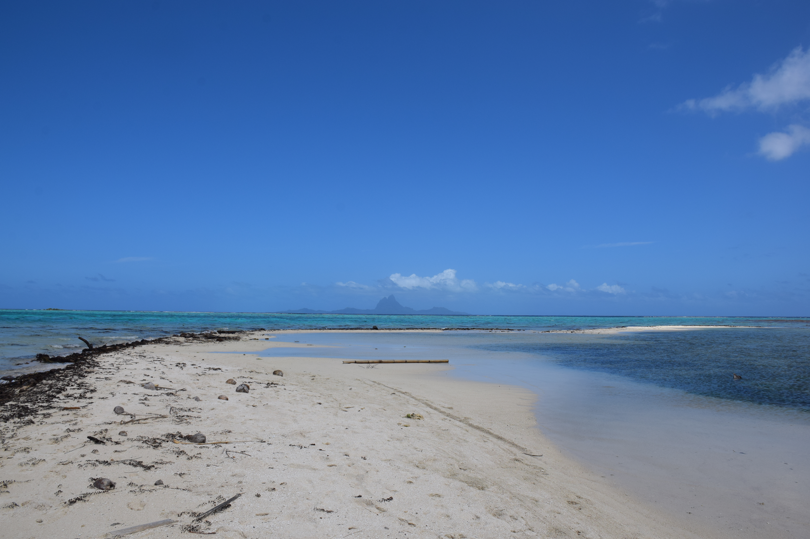

大溪地是個什麼樣的地方？

前往大溪地航班的登機口，圍繞在周遭的大部分是花襯衫，情侶，再不然就是和我一樣背著一顆包的背包客。即使從紐西蘭出發，傳入耳中的卻是腦袋無法讀取的法文。

  

世人口中的海島天花板，無論消費力如何都想一探究竟。

  

感受塑造來自四面八方，人文、食物、語言、氣味。

  

  

登機口開始提供的槴子花，大溪地航空的逃生影片，超市中整排的紅白酒，齊全的起司，
